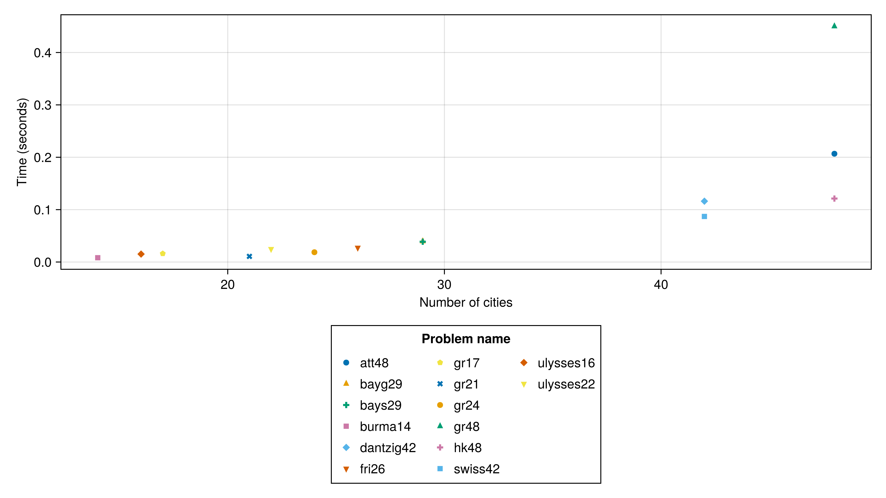
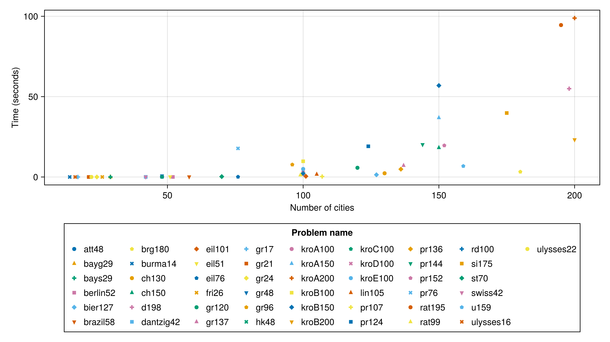

# TSPLIB benchmarking

Ran via `run.jl`.

See the committed CSV file for the results.

## Tours with up to 50 cities are solved exactly in < 1s

At least on my m1 macbook pro:

## Tours with up to 200 cities are solved exactly in ≤ 100s

But variance is high and your mileage may depend on the problem. At this scale a different approach will likely work better.

